## 产品概述

在用户端 ProfileTab 中添加 AI 饮食周报功能。用户点击按钮后，后端查询该用户最近 7 天已完成/已送达的订单数据，调用 OpenAI 生成饮食总结报告（含营养分析、饮食建议、消费趋势等），前端展示报告内容。遵循项目现有 AI 模块的 API 消息模式，前后端文件一一对应。

## 核心功能

- 用户在 ProfileTab 中看到"AI 饮食周报"独立 Card 区域，含生成按钮
- 点击按钮后实时调用后端 API，后端查询最近 7 天已完成/已送达订单，调用 OpenAI 生成结构化饮食报告
- 前端展示报告内容：摘要、营养评估、饮食建议、消费统计
- 生成过程中显示加载状态，错误时展示友好提示

## 技术栈

- 后端：Scala 3 + http4s + Circe（复用项目现有技术栈）
- 前端：React + TypeScript + Zustand（复用项目现有技术栈）
- AI 调用：复用 `OpenAIClient.chatCompletion(prompt, query)` 模式
- API 模式：`APIWithRoleMessage[Response]` + `apiWithRole[XxxAPIMessage, XxxResponse]("customer")`

## 技术架构

### 数据流

```mermaid
flowchart LR
    A[ProfileTab 生成按钮] --> B[aiDietWeeklyReportIO]
    B --> C[POST /api/aidietweeklyreportapi]
    C --> D[AIDietWeeklyReportAPIMessage.plan]
    D --> E[CustomerProfileTable.findByUsername]
    E --> F[OrderTable.list 过滤7天已送达/已完成]
    F --> G[OpenAIClient.chatCompletion]
    G --> H[parseResponse 解析JSON]
    H --> I[AIDietWeeklyReportResponse]
    I --> J[前端渲染报告Card]
```



### 模块划分

- **后端 ai 模块扩展**：在 `backend/src/ai/` 下新增 API 消息、Objects、路由注册
- **前端 ai 模块扩展**：在 `frontend/src/api/ai/` 和 `frontend/src/objects/ai/` 下新增对应文件
- **前端 ProfileTab 扩展**：在 ProfileTab 中新增 AI 周报 Card + 生成逻辑
- **前端 Store 扩展**：在 `useCustomerPortalStore` 中新增 AI 周报状态与调用方法

### 实现细节

#### 修改/新增目录结构

```
backend/src/ai/
├── api/
│   ├── AIAPIMessages.scala          # 修改：新增 AIDietWeeklyReportAPIMessage
│   └── (existing files)
├── objects/
│   ├── AIDietWeeklyReportRequest.scala  # 新增
│   └── AIDietWeeklyReportResponse.scala # 新增
├── routes/
│   └── AIRoutes.scala              # 修改：新增路由注册
└── utils/
    └── OpenAIClient.scala          # 不变

frontend/src/
├── api/ai/
│   ├── AISearchApi.ts              # 不变
│   └── AIDietWeeklyReportApi.ts    # 新增
├── objects/ai/
│   ├── AISearchRequest.ts          # 不变
│   ├── AISearchResponse.ts         # 不变
│   ├── AIDietWeeklyReportRequest.ts  # 新增
│   └── AIDietWeeklyReportResponse.ts # 新增
├── pages/CustomerPortal/
│   ├── ProfileTab.tsx              # 修改：新增 AI 周报 Card
│   └── index.tsx                   # 修改：传入 AI 周报 props
└── stores/pages/
    └── use-customer-portal-store.ts  # 修改：新增 AI 周报状态与方法
```

#### 关键数据结构

**后端 Request/Response**：

```
// AIDietWeeklyReportRequest.scala
final case class AIDietWeeklyReportRequest()

// AIDietWeeklyReportResponse.scala
final case class DietNutritionItem(name: String, amount: String, assessment: String)
final case class DietWeeklySummary(calorieTotal: String, orderCount: Int, topCategory: String, topMerchant: String)
final case class AIDietWeeklyReportResponse(
  summary: DietWeeklySummary,
  nutritionAnalysis: List[DietNutritionItem],
  suggestions: List[String],
  weeklyTrend: String,
  generatedAt: String
)
```

**前端 Request/Response**（一一对应）：

```typescript
// AIDietWeeklyReportRequest.ts
export interface AIDietWeeklyReportRequest {}

// AIDietWeeklyReportResponse.ts
export interface DietNutritionItem { name: string; amount: string; assessment: string }
export interface DietWeeklySummary { calorieTotal: string; orderCount: number; topCategory: string; topMerchant: string }
export interface AIDietWeeklyReportResponse {
  summary: DietWeeklySummary
  nutritionAnalysis: DietNutritionItem[]
  suggestions: string[]
  weeklyTrend: string
  generatedAt: string
}
```

**前端 API 类**：

```typescript
// AIDietWeeklyReportApi.ts
class AIDietWeeklyReportAPI extends APIMessage<AIDietWeeklyReportResponse> {
  readonly apiName = 'aidietweeklyreportapi'
}
export function aiDietWeeklyReportIO(): TaskIO<AIDietWeeklyReportResponse> { ... }
```

#### 后端 API 消息核心逻辑

```
final case class AIDietWeeklyReportAPIMessage() extends APIWithRoleMessage[AIDietWeeklyReportResponse]:
  override def plan(connection: Connection, username: String): IO[AIDietWeeklyReportResponse] =
    for
      _ <- OpenAIClient.configured.flatMap { ok =>
        if !ok then IO.raiseError(HttpApiError.BadRequest("AI 服务未配置")) else IO.unit
      }
      account <- CustomerProfileTable.findByUsername(connection, username)
        .flatMap(_.toRight(HttpApiError.NotFound("未找到顾客账号")).liftTo[IO])
      orders <- OrderTable.list(connection)
      sevenDaysAgo = java.time.LocalDate.now().minusDays(7).atStartOfDay(java.time.ZoneId.systemDefault()).toInstant.toEpochMilli
      recentOrders = orders.filter(o =>
        o.customerId == account.profile.id &&
        (o.status == OrderStatus.已送达 || o.status == OrderStatus.已完成)
      )
      prompt = buildDietReportPrompt(recentOrders)
      userMessage = "请根据我最近7天的外卖订单，生成饮食周报"
      resultJson <- OpenAIClient.chatCompletion(prompt, userMessage)
      response <- parseResponse(resultJson)
    yield response
```

#### 路由注册

在 `AIRoutes.scala` 中新增：

```
apiWithRole[AIDietWeeklyReportAPIMessage, AIDietWeeklyReportResponse]("customer")
```

#### 技术要点

- **apiName 自动推导**：`AIDietWeeklyReportAPIMessage` → `aidietweeklyreportapi`，前端 `apiName` 必须与此一致
- **前后端文件一一对应**：Request/Response 在 `objects/ai/` 下各一个文件，API 类在 `api/ai/` 下一个文件
- **不可变绑定**：后端只用 `val`，不用 `var`
- **数据以后端为准**：AI 报告由后端实时生成，不存前端缓存
- **7 天时间过滤**：基于 `placedAt` 字段字符串解析或后端计算时间窗口

### 安全措施

- API 需 customer 角色 JWT 鉴权（`apiWithRole[...]("customer")`）
- OpenAI API Key 通过环境变量注入，不硬编码
- 用户只能查看自己的订单数据（按 username → customerId 过滤）
- AI 返回内容需校验 JSON 结构，异常时返回友好错误

## 设计风格

采用与现有 ProfileTab 一致的 Glassmorphism + 渐变卡片风格，AI 周报 Card 融入现有布局，位于历史订单统计卡片与待收货订单 Card 之间。

## 页面规划

### ProfileTab 新增 AI 饮食周报 Card

在现有"历史订单"和"待收货"统计卡片区域之后、待收货订单列表之前，新增一个独立的 AI 饮食周报 Card。

### Block 设计

1. **AI 周报标题区**：图标 + "AI 饮食周报"标题 + 副标题"基于近7天订单智能分析"
2. **生成按钮区**：主色调渐变按钮"生成我的周报"，loading 时显示 spinner + "正在生成..."
3. **报告摘要区**：4 列统计卡片（总热量/订单数/最爱品类/常点商家）
4. **营养分析区**：竖向列表，每项含营养素名称、摄入量、评估标签（良好/偏高/偏低，用颜色区分）
5. **饮食建议区**：编号列表展示 AI 建议
6. **周趋势区**：文字描述本周饮食趋势变化
7. **底部时间戳**：报告生成时间

### 交互设计

- 点击生成按钮 → 按钮变为 loading 状态 → 报告区域渐现展示
- 无近7天订单时显示空状态提示"近7天暂无已完成订单，无法生成周报"
- 生成失败时显示错误提示，按钮可重新点击
- 报告生成后可再次点击刷新

## Agent Extensions

### Skill

- **type-safety-audit**: 审计新增 AI 周报功能的前后端类型安全一致性，确保 API 消息定义与 objects 类型前后端一一对应、ID 类型正确使用、无硬编码字符串替代枚举

### SubAgent

- **code-explorer**: 在实现过程中搜索跨文件依赖关系，确认 OrderTable 查询方法、Merchant 数据结构、现有 AI 模块完整实现细节