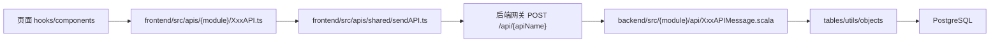
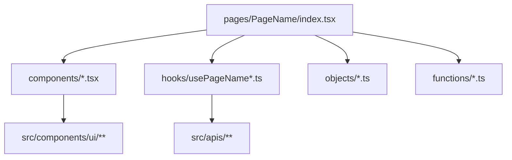

## Product Overview

本次重构聚焦项目结构统一、契约命名对齐与审计规则更新。页面展示效果保持现状，不做视觉改版；用户已可使用的顾客优惠券灰显与“含泪舍弃”功能需要在重构后继续可用。

## Core Features

- 后端接口消息按“一接口一文件”拆分，文件命名统一为 `XxxAPIMessage.scala`，移除聚合接口文件。
- 前端接口目录统一迁移到 `frontend/src/apis`，接口文件命名与后端接口消息保持 sample 风格对应。
- 前端页面目录按页面维度拆分为 `components`、`hooks`、`objects`、`functions`，降低大页面文件复杂度。
- 前后端接口、对象、响应包装类型保持一一对应，避免孤立文件、过时路径和命名漂移。
- 更新 `type-safety-audit` skill，将新的目录规范、模块范围和检查脚本写入技能说明与引用文档。
- 完成后运行前端类型检查、后端编译和类型安全审计，确保重构不破坏既有业务。

## Tech Stack

- 前端：Vite + React + TypeScript，现有 `@` 路径别名、TaskIO 风格 API 调用、shadcn/ui 组件保留。
- 后端：Scala 3 + http4s + Circe + cats-effect，继续通过统一 `POST /api/{apiName}` 网关注册 APIMessage。
- 数据：PostgreSQL 与现有表结构保持不变，本次不变更真实业务数据持久化策略。
- 技能与脚本：更新 `.codebuddy/skills/type-safety-audit/` 下的 Markdown 规则与 Bash 检查脚本。

## Existing Findings

- 后端当前仍有聚合文件：`backend/src/ai/api/AIAPIMessages.scala`、`user/api/UserAPIMessages.scala`、`merchant/api/MerchantAPIMessages.scala`、`order/api/OrderAPIMessages.scala`、`rider/api/RiderAPIMessages.scala`。
- 后端也已有少量独立文件，但命名为 `*Api.scala`，需要统一为 `*APIMessage.scala`。
- 前端当前 API 位于 `frontend/src/api/**`，需要迁移为 `frontend/src/apis/**`；当前基础设施在 `api/shared`，也需同步迁移并更新所有 `@/api` 导入。
- 前端页面集中在 `frontend/src/pages/{CustomerPortal,MerchantConsole,RiderApp,Login,Register}`，部分页面和 Tab 文件较大，需要按 sample 的页面级子目录拆分。
- `type-safety-audit` 当前仍引用 `frontend/src/api`、聚合 API 文件、缺少 `ai` 模块等过时规则。

## Architecture Alignment

### Refactor Data Flow



### API Naming Rule

- 后端文件：`XxxAPIMessage.scala`
- 后端类：`final case class XxxAPIMessage(...)`
- 前端文件：`XxxAPI.ts`
- 前端类：`class XxxAPI extends APIMessage<Response>`
- wire path：继续保持后端 `XxxAPIMessage` 推导出的 `xxxapi`，前端显式 `apiName` 可保留，避免生产构建依赖类名压缩行为。

### Page Structure Rule



## Module Division

### Backend API Split Module

- 责任：将每个 `APIMessage` 拆为独立文件，并删除聚合文件。
- 涉及路径：
- `backend/src/ai/api/*APIMessage.scala`
- `backend/src/user/api/*APIMessage.scala`
- `backend/src/merchant/api/*APIMessage.scala`
- `backend/src/order/api/*APIMessage.scala`
- `backend/src/rider/api/*APIMessage.scala`
- 注意事项：
- 聚合文件中的共享 private helper 迁移到现有 `utils/*ApiSupport.scala` 或新建模块内 support 对象。
- 后端 Scala 不新增 `var`，保持不可变 `val` 与 `copy` 风格。
- 路由文件可继续 `import delivery.{module}.api.*`，但必须能编译并注册全部 API。

### Frontend API Migration Module

- 责任：将 `frontend/src/api` 全量迁移到 `frontend/src/apis`，并统一 sample 风格命名。
- 涉及路径：
- `frontend/src/apis/shared/*`
- `frontend/src/apis/ai/*API.ts`
- `frontend/src/apis/user/*API.ts`
- `frontend/src/apis/merchant/*API.ts`
- `frontend/src/apis/order/*API.ts`
- `frontend/src/apis/rider/*API.ts`
- 注意事项：
- 删除或停止使用 `*APIMessages.ts` barrel 聚合文件。
- 全局替换 `@/api/...` 为 `@/apis/...`。
- 保留 `CustomerVoucherDiscardAPI` 调用链，确保“含泪舍弃”按钮仍通过后端写入。

### Objects and Response Wrapper Alignment Module

- 责任：对齐前后端 objects 文件数量、名称与字段语义。
- 建议规则：
- 领域对象继续放在 `objects/{module}`。
- 纯 API 响应包装类型按 sample 迁移到 `objects/{module}/apiTypes`，前后端同步移动。
- 如果暂不移动所有响应包装，也必须在 skill 文档中明确当前阶段规则，避免脚本误报。

### Frontend Page Split Module

- 责任：按页面目录拆分大文件，保持页面路由与视觉效果不变。
- 重点页面：
- `frontend/src/pages/CustomerPortal`
- `frontend/src/pages/MerchantConsole`
- `frontend/src/pages/RiderApp`
- `frontend/src/pages/Login`
- `frontend/src/pages/Register`
- 拆分策略：
- `index.tsx` 只保留页面装配。
- 视图块进入 `components/`。
- 数据加载、提交、状态协调进入 `hooks/`。
- 页面局部类型进入 `objects/`。
- 纯计算、格式化、筛选逻辑进入 `functions/`。

### Skill Update Module

- 责任：更新 `.codebuddy/skills/type-safety-audit/` 的规则、参考表和脚本。
- 涉及文件：
- `.codebuddy/skills/type-safety-audit/SKILL.md`
- `.codebuddy/skills/type-safety-audit/references/fe-be-contract-map.md`
- `.codebuddy/skills/type-safety-audit/references/type-safety-issues-catalog.md`
- `.codebuddy/skills/type-safety-audit/scripts/check-type-safety.sh`
- 必须补齐：
- `ai` 模块检查。
- `frontend/src/apis` 新路径。
- 后端 `*APIMessage.scala` 单文件规则。
- 前端 `*API.ts` 命名规则。
- 禁止残留 `frontend/src/api` 和聚合 API 文件。

## Core Directory Structure

```text
Type-safe_project/
├── backend/src/
│   ├── ai/api/
│   │   └── XxxAPIMessage.scala
│   ├── user/api/
│   │   └── XxxAPIMessage.scala
│   ├── merchant/api/
│   │   └── XxxAPIMessage.scala
│   ├── order/api/
│   │   └── XxxAPIMessage.scala
│   └── rider/api/
│       └── XxxAPIMessage.scala
├── frontend/src/
│   ├── apis/
│   │   ├── shared/
│   │   ├── ai/
│   │   ├── user/
│   │   ├── merchant/
│   │   ├── order/
│   │   └── rider/
│   └── pages/
│       └── PageName/
│           ├── index.tsx
│           ├── components/
│           ├── hooks/
│           ├── objects/
│           └── functions/
└── .codebuddy/skills/type-safety-audit/
    ├── SKILL.md
    ├── references/
    └── scripts/check-type-safety.sh
```

## Key Code Structures

### Backend API Message

```
package delivery.user.api

import cats.effect.IO
import delivery.shared.api.APIWithRoleMessage
import delivery.shared.objects.OkResponse
import delivery.shared.objects.VoucherId

import java.sql.Connection

final case class CustomerVoucherDiscardAPIMessage(voucherId: VoucherId) extends APIWithRoleMessage[OkResponse]:
  override def plan(connection: Connection, username: String): IO[OkResponse] =
    // delegate to module support/table logic
    ???
```

### Frontend API Message

```typescript
import { APIMessage } from '@/apis/shared/APIMessage'
import type { TaskIO } from '@/apis/shared/TaskIO'
import { sendAPI } from '@/apis/shared/sendAPI'

class CustomerVoucherDiscardAPI extends APIMessage<OkResponse> {
  readonly apiName = 'customervoucherdiscardapi'

  constructor(readonly voucherId: VoucherId) {
    super()
  }
}

export function discardCustomerVoucherIO(voucherId: VoucherId): TaskIO<OkResponse> {
  return sendAPI(new CustomerVoucherDiscardAPI(voucherId))
}
```

## Technical Implementation Plan

### 1. Backend API Split

- Problem Statement：聚合 API 文件不符合 sample 的一 API 一文件规范。
- Solution Approach：按 case class 拆文件，共享逻辑下沉至 `utils`。
- Key Technologies：Scala 3 package wildcard import、Circe auto codec、http4s APIMessageRouter。
- Implementation Steps：

1. 从聚合文件提取所有 `final case class XxxAPIMessage`。
2. 为每个 API 创建同名 `XxxAPIMessage.scala`。
3. 将跨 API helper 迁移到 support 对象。
4. 删除聚合文件并修正 imports。
5. 编译验证路由注册仍完整。

- Testing Strategy：运行 `cd backend && sbt -batch compile`。

### 2. Frontend API Migration

- Problem Statement：当前 API 路径为 `src/api`，且文件大小写不完全符合 sample。
- Solution Approach：整体迁移为 `src/apis`，文件改为 `XxxAPI.ts`，更新全部导入。
- Key Technologies：TypeScript path alias、TaskIO、fetch API client。
- Implementation Steps：

1. 移动 `api/shared` 到 `apis/shared`。
2. 将各模块 `*Api.ts` 重命名为 `*API.ts`。
3. 移除 `*APIMessages.ts` barrel 文件。
4. 更新页面、组件、store、lib 中的导入路径。
5. 验证所有 API 调用仍使用后端真实数据。

- Testing Strategy：运行 `cd frontend && npm run typecheck`。

### 3. Page-Level Refactor

- Problem Statement：页面文件过大，组件、状态与函数混在页面根目录。
- Solution Approach：按页面建立 `components/hooks/objects/functions`，保持 UI 和路由不变。
- Key Technologies：React function components、custom hooks、TypeScript interfaces。
- Implementation Steps：

1. 将页面根目录视图块移动到 `components/`。
2. 将数据加载和交互提交逻辑移动到 `hooks/`。
3. 将页面局部类型移动到 `objects/`。
4. 将 helper、formatter、filter 移动到 `functions/`。
5. 逐页 typecheck，避免一次性大爆炸式改动。

- Testing Strategy：重点检查登录、注册、顾客门户、结算页、商户后台、骑手端可用。

### 4. Skill and Documentation Update

- Problem Statement：技能规则与文档仍描述旧路径和旧聚合文件。
- Solution Approach：同步更新 skill、contract map、issues catalog 和脚本。
- Key Technologies：Markdown references、Bash filesystem checks。
- Implementation Steps：

1. 更新 `SKILL.md` 的关键路径和模块列表。
2. 重写契约对照表为 `src/apis` 与 `*APIMessage.scala`。
3. 更新问题目录中的过时案例。
4. 修改脚本检查 `ai`、`src/apis`、聚合文件残留。
5. 文档中补充 sample 结构约束。

- Testing Strategy：运行 `bash .codebuddy/skills/type-safety-audit/scripts/check-type-safety.sh /Users/leonli/Desktop/Type-safe_project`。

## Integration Points

- 前端页面只通过 `frontend/src/apis/**` 调用后端，不在浏览器伪造真实业务状态。
- 后端 API 继续通过 `DeliveryRoutes` 聚合各模块 route 注册，并经网关端口对外暴露。
- JSON 格式继续由 Circe 与 TypeScript interface 对齐；objects 移动时必须同步修正前后端 import。
- 认证继续使用 JWT Bearer，`APIWithRoleMessage` 和前端 `Authorization` header 流程不变。

## Technical Considerations

- Logging：沿用现有后端 log4cats/slf4j 与前端错误处理方式，不新增独立日志框架。
- Performance：重构不改变请求数量；页面拆分可为后续按页面懒加载创造条件，但本次不强制引入新加载策略。
- Security：保留后端角色校验；“舍弃优惠券”等真实业务写操作仍必须由后端验证过期状态后持久化。
- Scalability：一 API 一文件后新增业务能力时可独立扩展，skill 脚本能及时发现契约漂移。

## Agent Extensions

### SubAgent

- **code-explorer**
- Purpose：系统盘点当前项目与 sample 的 API、objects、页面目录和 skill 文件差异。
- Expected outcome：生成可执行的文件级重构清单，避免遗漏模块和导入路径。

### Skill

- **skill-creator**
- Purpose：指导更新既有 `type-safety-audit` skill 的说明、引用资料和脚本结构。
- Expected outcome：skill 文档符合 CodeBuddy skill 规范，规则清晰且可复用。

- **type-safety-audit**
- Purpose：在重构完成后审计前后端 API、objects、路径和真实业务状态来源。
- Expected outcome：确认 `src/apis`、`*APIMessage.scala`、objects 对应关系和优惠券舍弃功能均未回退。